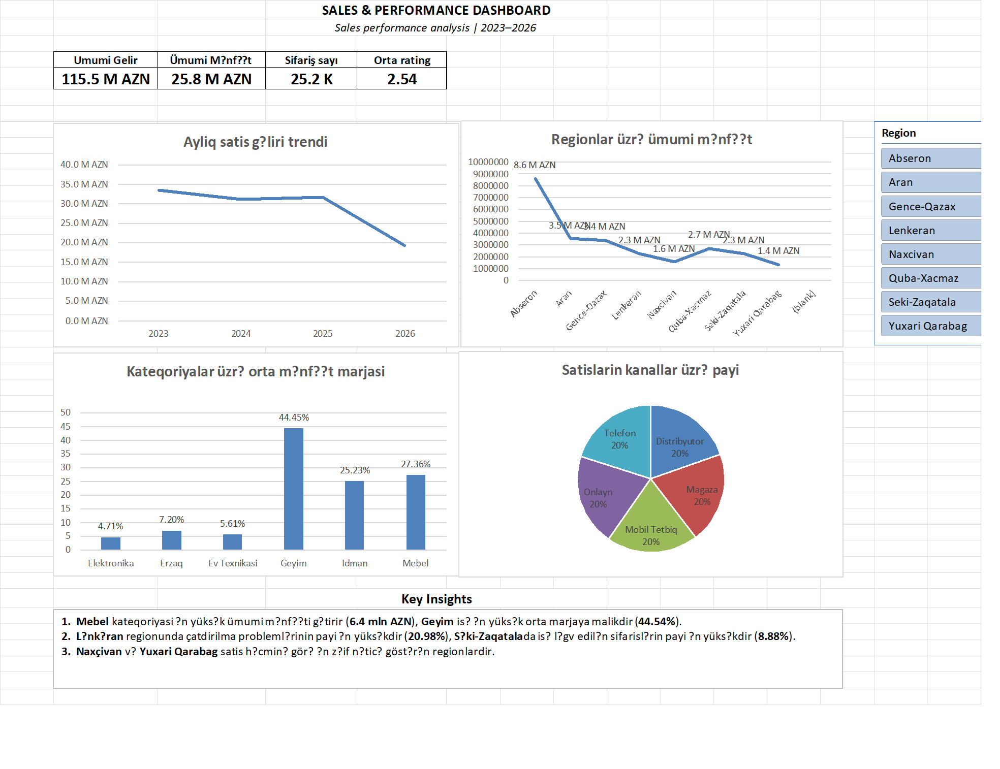

# Retail Sales Analysis

## Layihe haqqinda

Bu layihede 25,000+ setirden ibaret retail sales datası temizlenmis ve Microsoft Excel vasitesile analiz edilmisdir.

Layihenin esas meqsedi satis geliri, menfeet, menfeet marjasi, regionlar, mehsul kateqoriyalari ve satis kanallari uzre esas biznes neticelerini mueyyen etmekdir.

## Biznes suallari

1. Hansı regionlar daha yuksek umumi menfeet getirir?
2. Hansı kateqoriyalar daha yuksek menfeet marjasina malikdir?
3. Ayliq satis geliri zaman uzre nece deyisir?
4. Satislar hansi kanallar uzre bolunur?

## Data temizleme

- Melumatlardaki bos ve uyğunsuz deyerler yoxlanilmisdir.
- Tarix melumatlari standartlasdirilmisdir.
- Kateqoriya ve diger metn sahelerinde uyğunsuzluqlar duzeltilmisdir.
- Analiz ucun elave helper sutunlari yaradılmisdir.

## Istifade olunan aletler

- Microsoft Excel
- PivotTable
- PivotChart
- Slicer
- VLOOKUP / XLOOKUP
- SUMIFS
- AVERAGEIFS
- Statistical functions
- Data Cleaning

## Esas neticeler

- Geyim kateqoriyasi en yuksek orta menfeet marjasina malikdir.
- Abseron regionu en yuksek umumi menfeet getiren regiondur.
- Satis kanallari uzre paylar bir-birine nisbeten yaxindir.
- Ayliq satis gelirinde 2026-ci ilde nezere carpacaq azalma musahide olunur.

## Dashboard

Asagida layihe uzre hazirlanmis interaktiv Excel dashboardunun goruntusu teqdim olunur.

## Fayllar

- `Sales Analysis.xlsb` — temizlenmis data, PivotTable-lar, PivotChart-lar, dashboard ve slicerleri ehate eden esas Excel faylidir.
- `Dashboard.png` — dashboardun vizual goruntusudur.

## Muellif

**Ays | 2026**
